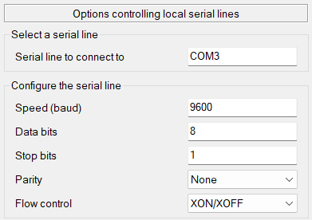
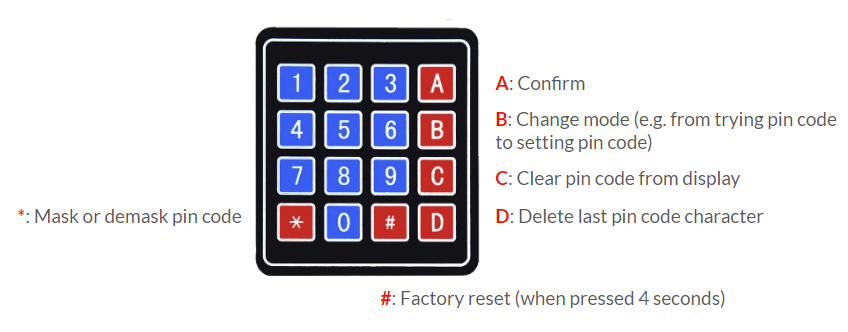
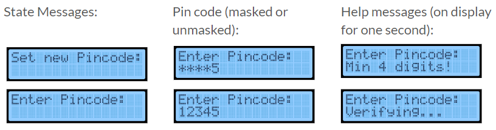

# Documentation Project Zahlenschloss 
## 1. Contributors
- Kai Kustermann (kk147)
- Hannes Frey (hf018)
## 2. Project Description
(TODO: Hier bild von safe einfügen)

The project implements a safe using an ATmega328P as microcontroller, a 4x4 matrix keypad to capture user input and an LCD display as output to display important information about the state of the system. Two LEDs are used to indicate if the safe is open or closed. A DC locking bolt acts as mechanic mechanism for closing and opening the lock, which operates using a mosfet. Optionally a buzzer can be added to give auditory feedback to the user.     
The project is written in C using AVR-GCC as compiler without any additional libraries as external dependencies.
## 3. Hardware Setup
### 3.1 Circuit Diagram
### 3.2 Chassis and 3D Printing
## 4. Software Setup
The project is exclusively written in C using AVR-GCC as compiler without any additional libraries as external dependencies. For flashing, the software AVRDUDE is used. The tool Make is used for automating the build and deployment process. It is recommended to use VSCode as code editor, as it was used during the development of the project and this documentation contains some useful settings for getting started with development using VSCode.        
### 4.1 Download AVR-GCC
Download the AVR-GPP compiler and toolchain for the operating system of your development machine. It is recommended to use the latest version 3.7.0. The official version can be found on the [Microchip website](https://www.microchip.com/en-us/tools-resources/develop/microchip-studio/gcc-compilers).
### 4.2 Download AVRDUDE
Download AVRDUDE for the operating system of your development machine. Please refer to the official [GitHub Repository](https://github.com/avrdudes/avrdude) for detailed installation steps.
### 4.3 Download Make
For the build and deployment process, the tool Make is used. Download Make for the operating system of your development machine.
- Windows:  
    - Download make from [this website](https://gnuwin32.sourceforge.net/packages/make.htm) and follow the installation process
    - Add Make to system PATH environment variable
- Linux:    
    `
    sudo apt install make
    `
### 4.4 Logging Setup
For logging messages on the development machine, a USB serial connection from the ATmega328P to the development machine is used. On Windows, we recommend using PuTTY for opening a terminal to the serial port. On Linux the screen command can be used.
- Windows:  
    - Download PuTTY from [the official website](https://putty.org/) and follow the installation process
    - Configure the serial line as follows:     
           
    - **Important:**    
    If you want to change the COM port to a port of your choice, make sure to also change the variable `PROGRAMMER_PORT` in the Makefile.
- Linux:        
Use the `screen` command to receive serial data. The syntax is as follows:   
`screen [DEVICE NAME] [BAUDRATE]`,  
where the defined baudrate for the atmega328 is 9600.
### 4.5 VSCode Setup (Optional)
VSCode can give a nice development experience by providing helpful features like IntelliSense. Here is an example `c_cpp_properties.json` for configuring the editor on windows.
```json
{
    "configurations": [
        {
            "name": "win32",
            "includePath": [
                "${workspaceFolder}/**",
                "C:\\path\\to\\your\\avr\\download\\avr",
            ],
            "defines": [
                "__AVR_ATmega328P__",
                "F_CPU=16000000UL"
            ],
            "macFrameworkPath": [],
            "compilerPath": "C:\\path\\to\\your\\avr\\download\\bin\\avr-gcc -xc -E -v -",
            "cStandard": "c11",
            "cppStandard": "gnu++14",
            "intelliSenseMode": "clang-x64"
        }
    ],
    "version": 4
}
```
## 5. Build and Deployment
First, configure the program to your needs in main.c. An important setting is the environment setting (DEV or PROD), which disables logging in PROD for performance gains.   
The build and deployment process is automated with a Makefile. It provides the following commands:  
- To flash the project onto an ATmega328P microcontroller, use the command:   
`make program`  
For Windows, the default programmer port is set to COM3, for Linux it is set to /dev/ttyUSB0. Make sure to connect the ATmega328P to the right USB port or change the setting.
- To remove the generated .hex, .elf and .o files from your development machine, use the command:    
`make clean`  
### Makefile
The build step, which is defined in the Makefile uses the AVR-GCC compiler to compile and link the project. It automatically converts all C and C++ files to object files and then transforms them into linked .elf files. After that, the command `avr-objcopy` is used to create .hex files, which contain machine language code in hexidecimal form. AVRDUDE is used to write the .hex file to the flash memory of the microcontroller.
## 6. Code
The code is structured like follows:
```bash
├── main.c
├── configuration.h
├── drivers
│  ├── buzzer.c
│   ├── buzzer.h
│   ├── i2c.c
│   ├── i2c.h
│   ├── keypad.c
│   ├── keypad.h
│   ├── lcd.c
│   └── lcd.h
├── helpers
│   ├── eepromHelpers.c
│   ├── eepromHelpers.h
│   ├── stringHelpers.c
│   ├── stringHelpers.h
│   ├── timerHelpers.c
│   └── timerHelpers.h
├── lock
│   ├── hashing.c
│   ├── hashing.h
│   ├── lock.c
│   ├── lock.h
│   ├── program.c
│   └── program.h
├── logging
    ├── logging.c
    ├── logging.h
    ├── uart.c
    └── uart.h
```
The main logic of the program can be found lock.c in the lock folder, including the state machine of the lock. Several helpers, as well as drivers are used in the application, of which keypad.c and lcd.c are the most important ones, as they represent the drivers for the I/O hardware.
The lock can be configured in main.c.   
For more information about the code and specific functions, please refer to the code comments.
## 7. Operation Manual
The safe is controlled via keypad and gives feedback on an LCD display. The safe can be in 5 different states with different behaviors and functions.
### Keypad
The core keypad functions are the same in each state. The keypad has 10 blue number keys, which can be used for the pin code and 6 red symbol keys, which have different functions:


### Display
The display gives feedback regarding the state of the system as well as the given pin code and additional temporary help messages. 


### States
1. **Setting the initial pin code**:
When first turning on the safe, you will be prompted to set a new pin code.
2. **Entering the pin code**: When a pin code is set, you are prompted to enter the currently set pin code to open the lock. When pressing B in this state, the safe will enter state 4.
3. **Opening the lock**: When the right pin code was entered, the lock opens. When pressing B in this state, the safe will enter state 2.
4. **Setting a new pin code**: This state asks for the set pin code first. If the given pin code is right, it will let you set a new pin code. When pressing B in this state, the safe will enter state 2.
5. **Resetting to factory settings**: When holding the key # in any state for 4 seconds, the safe will enter the reset state. Here, you are prompted to enter the currently set pin code. If the correct pin code is entered, the lock will reset itself to factory settings.
## 8. Credits and Sources